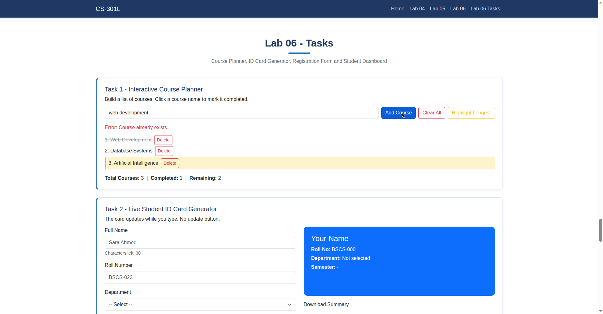
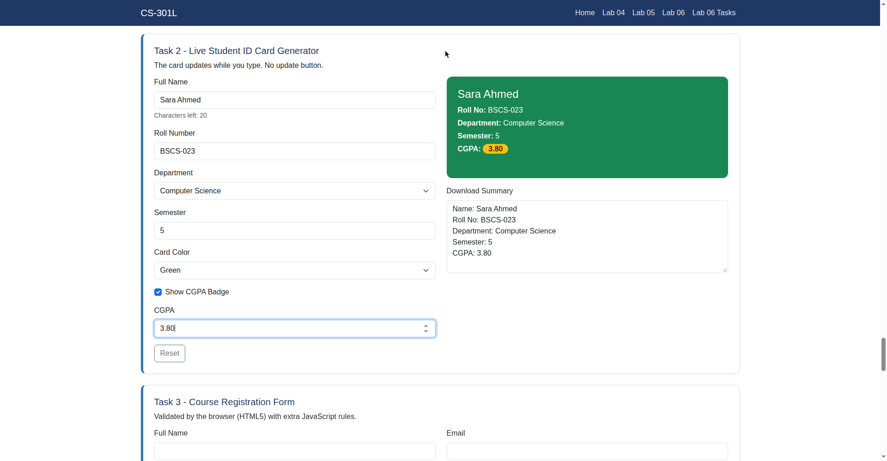
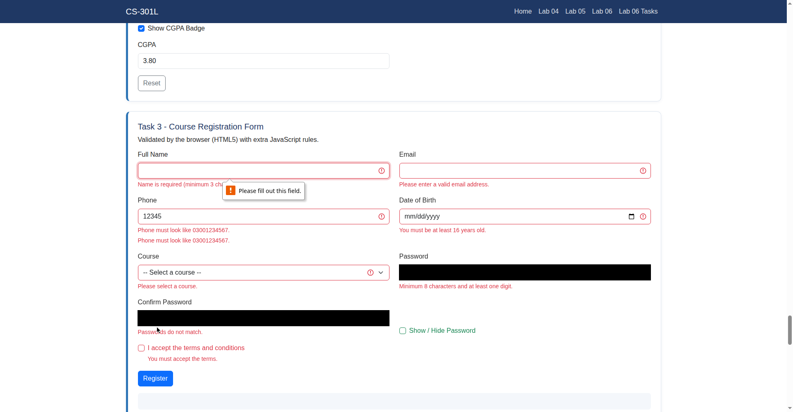
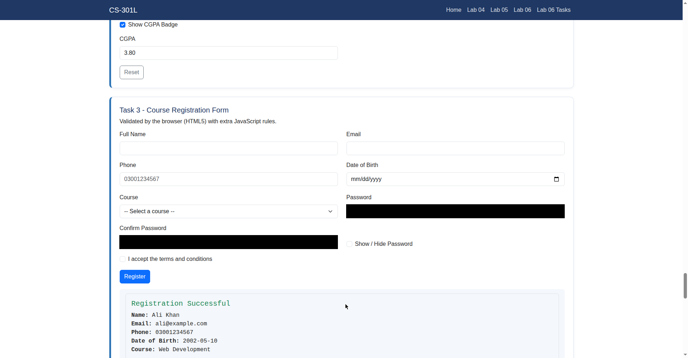
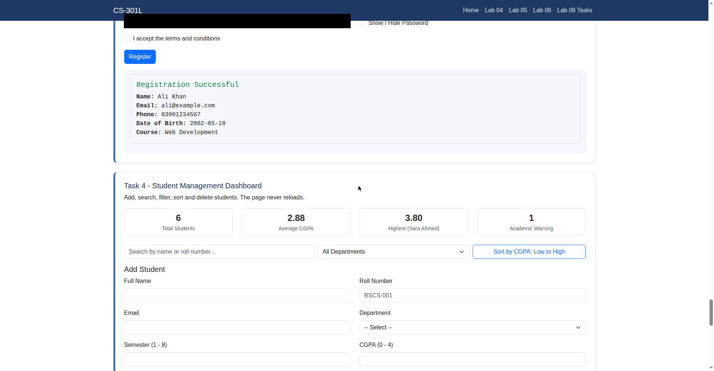
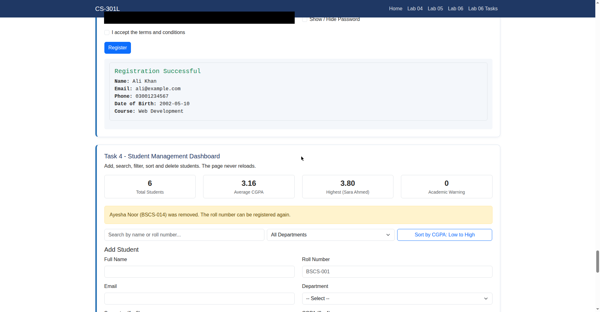

# Full Stack Lab 06 — DOM, Events & Form Validation

A university lab project covering **DOM selection and manipulation, event
handling, JavaScript and HTML5 form validation, and dynamic page updates**,
with four assignment tasks displayed dynamically on a single webpage.

## Tech Stack

- HTML5
- Bootstrap 5.3 (CDN) for cards, forms, alerts, and the Edit CGPA modal
- Vanilla JavaScript (no modules — a normal `<script>` tag is enough)

## Manual Demos (lab06.js)

Nine guided sections from the lab manual: DOM selection
(`getElementById`, `querySelector`, `querySelectorAll`), changing content /
styles / attributes, creating and removing elements, click events, input and
change events, form submit with `preventDefault()`, basic JavaScript
validation, HTML5 validation with the Constraint Validation API, and a
Student Registration System that combines everything (validation, cards,
search, delete with event delegation, live statistics).

## Assignment Tasks (lab06-tasks.js)

### Task 1 — Interactive Course Planner

A planner where students build a course list. Courses are added through an
input and button; each item is created with `document.createElement()` and
appended to the list. Empty values and duplicates (compared
case-insensitively with `some()`) are rejected with a red message. The
input is cleared and focused after every add. Each course has a Delete
button handled by **event delegation** (one click listener on the `<ul>`),
and clicking a course name toggles a completed class with
`classList.toggle()` (strike-through style). A live counter shows Total,
Completed, and Remaining courses. **Clear All** empties the list, and
**Highlight Longest** uses `querySelectorAll()` to find the longest course
name and highlights it with a CSS class.

### Task 2 — Live Student ID Card Generator

A form (name, roll number, department, semester, card color) beside an ID
card that updates **while typing** — `input` events on text/number fields,
`change` events on selects, no update button. Empty fields show placeholders
("Your Name"). A live character counter uses the input's `maxlength` (30).
The card background changes through `element.style.backgroundColor`. A
"Show CGPA Badge" checkbox reveals a CGPA field and a badge on the card. A
Reset button restores the initial state, and a read-only textarea shows a
live plain-text summary built with a **template literal**.

### Task 3 — Course Registration Form with HTML5 Validation

A registration form validated by the browser wherever possible: `required`,
`minlength`, `type="email"`, and `pattern="03[0-9]{9}"` on the phone field.
JavaScript adds three custom rules with `setCustomValidity()`: the password
must contain a digit, the confirmation must match, and the date of birth
must make the student at least 16. A live password-strength meter
(Weak / Medium / Strong, from Sir's validation demo, rewritten with
`addEventListener`) updates under the password field while typing. A live message under the Phone field
uses the `input` event and the `validity` object (`valueMissing`,
`patternMismatch`, `valid`). Bootstrap's `was-validated` class is added
after the first submit attempt, a checkbox toggles password visibility, and
a successful submit builds a summary card from `FormData` (the password is
never shown) and resets the form.

### Task 4 — Student Management Dashboard

A dashboard over an array of six student objects. Students render as cards
built with `createElement()`, each showing name, roll number, department,
semester, CGPA, and a grade-based status from a function using the
**ternary operator** (Excellent ≥ 3.00, Good ≥ 2.50, Satisfactory ≥ 2.00,
Academic Warning below). The Add Student form uses `novalidate` with HTML5
attributes read through the **validity API**, plus a custom unique-roll
rule; invalid fields get red messages, valid ones green. A search box
filters while typing, a department dropdown filters with `filter()`, and a
button toggles CGPA sort high ↔ low with `sort()` — all three work together.
Delete and Edit CGPA buttons are handled by **event delegation** (`findIndex`
+ `splice` for delete; a Bootstrap modal with validated input for edit — no
`prompt()`). Statistics (total students, average CGPA via `reduce()`,
highest CGPA with name, warning count) update after every add, delete, and
edit.

## Concepts Covered

| Concept | Where it is used |
| --- | --- |
| `getElementById` / `querySelector` / `querySelectorAll` | Selecting sections, lists, and cards |
| `textContent` vs `innerHTML` | Safe text vs HTML output; user text escaped with `lab06Escape()` |
| `classList` (add / remove / toggle / contains) | Highlight, completed, longest-course, validation styles |
| `setAttribute` / `getAttribute` | Changing link href/target |
| `createElement` / `appendChild` / `remove` | Planner items, dashboard cards |
| `addEventListener` (click, input, change, submit, blur, reset) | Every task; no inline `onclick` |
| Event object (`type`, `target`, `clientX/Y`) | Click counter details |
| Event delegation | Planner delete buttons, dashboard Edit/Delete buttons |
| `preventDefault()` | Stops forms from reloading the page |
| `FormData` | Reading the feedback and registration forms |
| Basic JS validation | Name/email/age checks with regex and range rules |
| HTML5 attributes (`required`, `pattern`, `min`, `max`, `minlength`) | Registration and dashboard forms |
| Constraint Validation API (`validity`, `setCustomValidity()`, `was-validated`) | Live messages, custom rules, Bootstrap styles |
| `novalidate` | Turns off browser checks so JavaScript owns validation |
| Array methods (`filter`, `reduce`, `sort`, `findIndex`, `splice`, `some`, `map`, `every`) | Dashboard logic, planner duplicates/counters |
| Destructuring, template literals, arrow functions, ternary | Card rendering, summaries, status |
| Dynamic updates without reload | All four tasks |

## Output Screenshots

### Task 1 — Interactive Course Planner



Three courses added, "Web Development" marked completed (strike-through),
"Artificial Intelligence" highlighted as the longest name, and the red
duplicate error after adding "web development" again (case-insensitive
check). Counters: Total 3, Completed 1, Remaining 2.

### Task 2 — Live Student ID Card Generator



The card updates live: green background from the color select, CGPA badge
shown after checking the box, character counter at "Characters left: 20",
and the read-only summary textarea.

### Task 3 — Course Registration Form



Submitting an empty form: the browser blocks it ("Please fill out this
field") and every field shows its red message, including the live phone
message "Phone must look like 03001234567."



Valid submission: green "Registration Successful" card with all values —
the password is never shown — and the form is reset.

### Task 4 — Student Management Dashboard



Initial state: 6 students, 2.88 average CGPA, 3.80 highest (Sara Ahmed),
1 Academic Warning, with search, department filter, and CGPA sort.



After deleting Ayesha Noor: 6 students, 3.16 average, 0 warnings, and the
yellow notice that the roll number can be registered again.

## Project Structure

```
full-stack-lab-06/
├── index.html       # Page structure: manual demos + four Lab 06 task sections
├── style.css        # Lab 06 demo styles + task styles (planner, ID card)
├── lab06.js         # Manual demos: DOM, events, validation, registration system
├── lab06-tasks.js   # Assignment Tasks 1–4
├── screenshots/     # Output screenshots of the four tasks
└── README.md
```

## How to Run

No modules are used, so the page works by double-clicking `index.html`, but
**Live Server** (VS Code) is recommended.

1. Open the project folder in VS Code.
2. Run `index.html` with the **Live Server** extension (or any static server).
3. Internet access is required for the Bootstrap CDN.

## Author

Hussnain Ahmad — BSCS, Air University, Islamabad
